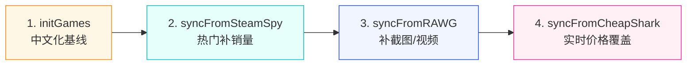

# 云函数目录

> 本目录存放所有微信云开发云函数。

## 📦 函数清单

### 业务函数

| 函数 | 用途 | 触发方式 |
|---|---|---|
| [`login/`](./login) | 微信登录，自动建档 | 小程序前端调用 |
| [`userProfile/`](./userProfile) | 用户资料 get/update（昵称变更走内容安全审核） | 小程序前端调用 |
| [`getHomeConfig/`](./getHomeConfig) | 首页配置聚合（banners + hotKeywords + featured，含 mock 兜底） | 小程序前端调用 |
| [`getGameList/`](./getGameList) | 首页游戏列表（含 mock 兜底，支持 rating/new/hot/discount/sales 排序） | 小程序前端调用 |
| [`getGameDetail/`](./getGameDetail) | 游戏详情 + 浏览历史上报 + 相关推荐 | 小程序前端调用 |
| [`searchGames/`](./searchGames) | 搜索游戏（search/hot/suggest，含 includeExternal=true 调 CheapShark） | 小程序前端调用 |
| [`importGame/`](./importGame) | 把外部数据源（CheapShark+Steam Store）的游戏导入本地 games 集合 | 小程序前端调用 |
| [`favorite/`](./favorite) | 收藏 CRUD（add/remove/list/toggle/updateStatus） | 小程序前端调用 |
| [`history/`](./history) | 浏览历史 list/clear/remove（report 在 getGameDetail 内完成） | 小程序前端调用 |
| [`gameList/`](./gameList) | 游戏清单 CRUD（list/detail/create/update/delete，含内容安全审核） | 小程序前端调用 |
| [`gameListItem/`](./gameListItem) | 清单内游戏 + 评价（add/remove/updateReview/list/inLists） | 小程序前端调用 |
| [`contentCheck/`](./contentCheck) | 内容安全审核（封装 msgSecCheck V2 + imgSecCheck，需 openapi 权限） | 云函数互调 / 前端 |

### 数据同步函数（管理端）

| 函数 | 数据源 | 是否需 Key | 用途 |
|---|---|---|---|
| [`initGames/`](./initGames) | 内置种子 | ❌ | 一键导入 25 款精选中文游戏 |
| [`initBanners/`](./initBanners) | 内置种子 | ❌ | 一键导入 4 条示例首页 banner（榜单跳转入口） |
| [`syncFromSteamSpy/`](./syncFromSteamSpy) | [SteamSpy](https://steamspy.com/api.php) | ❌ | 拉取 Steam 热门游戏（销量、评分） |
| [`syncFromCheapShark/`](./syncFromCheapShark) | [CheapShark](https://apidocs.cheapshark.com) | ❌ | 实时打折信息 |
| [`syncFromRAWG/`](./syncFromRAWG) | [RAWG.io](https://rawg.io/apidocs) | ✅ 免费 | ⚠️ 出口不通暂禁用。截图、视频、标签、详细元数据 |
| [`syncFromIGDB/`](./syncFromIGDB) | [IGDB (Twitch)](https://api-docs.igdb.com/) | ✅ 免费 | mode=batch 入参 IGDB 数据，云函数只 upsert；由本地脚本 [`scripts/sync-igdb-local.js`](../scripts/sync-igdb-local.js) 配合（见 §6） |
| [`syncAllSources/`](./syncAllSources) | 全部 | - | **一键聚合调度**（含 5 个主机平台 + IGDB 兜底） |

---

### 🎨 首页 Banner 运营指南

[`banners`](https://docs.cloudbase.net/cms/database/intro) 集合用于驱动首页轮播运营位，控制台可直接编辑：

#### Schema

```js
{
  title: '夏日特惠',         // 主标题（白色大字）
  subtitle: '热门游戏低至 3 折', // 副标题（可选）
  image: 'https://...',     // 背景图（可选，无图则用 bgColor/gradient）
  bgColor: '#ff7d00',       // 纯色背景兜底
  gradient: 'linear-gradient(135deg, #667eea 0%, #5b3aa8 100%)', // 渐变（优先级最高）
  linkType: 'rank',          // game/rank/category/list/search/external/none
  linkValue: 'hot',          // linkType 对应的值
  sort: 1,                   // 排序，越小越靠前
  status: 1,                 // 0=下架, 1=上线
  startAt: Date,             // 生效时间（可选）
  endAt: Date,               // 失效时间（可选）
}
```

#### linkType 跳转行为

| linkType | linkValue 示例 | 跳转行为 |
|---|---|---|
| `game` | `gameId123` | 跳转游戏详情页 |
| `rank` | `hot` / `new` / `rating` / `discount` | 切到榜单 Tab 并预选对应子榜 |
| `category` | （任意） | 切到分类页 |
| `list` | `cat_action` | 跳到该分类的游戏列表 |
| `search` | `Roguelike` | 跳到该关键词的搜索结果页 |
| `external` | `https://...` | 复制链接到剪贴板（小程序限制无法直接打开外链） |
| `none` | - | 不响应（纯展示） |

#### 快速上手

1. 部署 [`initBanners`](./initBanners) 云函数 + 创建 `banners` 集合（权限：所有用户可读，仅管理端可写）
2. 控制台 → 云函数 → `initBanners` → 云端测试 → 调用（无参数）
3. 4 条示例 banner 自动写入，刷新小程序首页即可看到轮播
4. 后续在控制台 `banners` 集合可视化编辑即可（无需改代码）

---

## 🚀 首次部署完整流程

### 1. 前置：开通云开发

详见项目根 README，需先把 `appid` 替换为真实 AppID，并在微信开发者工具开通云开发环境。

### 2. 安装依赖（每个云函数目录都要执行一次）

在微信开发者工具中右键云函数目录 → **"在终端中打开"**：

```bash
cd cloudfunctions/login && npm install
cd cloudfunctions/userProfile && npm install
cd cloudfunctions/getHomeConfig && npm install
cd cloudfunctions/getGameList && npm install
cd cloudfunctions/getGameDetail && npm install
cd cloudfunctions/searchGames && npm install
cd cloudfunctions/importGame && npm install
cd cloudfunctions/favorite && npm install
cd cloudfunctions/history && npm install
cd cloudfunctions/gameList && npm install
cd cloudfunctions/gameListItem && npm install
cd cloudfunctions/contentCheck && npm install
cd cloudfunctions/initBanners && npm install
cd cloudfunctions/initGames && npm install
cd cloudfunctions/syncFromSteamSpy && npm install
cd cloudfunctions/syncFromCheapShark && npm install
cd cloudfunctions/syncFromRAWG && npm install
cd cloudfunctions/syncFromIGDB && npm install  # batch 模式由本地脚本喂数据（见 §6）
cd cloudfunctions/syncFromSteamStore && npm install
cd cloudfunctions/syncAllSources && npm install
```

> 或更简单：在每个云函数目录右键 → **"上传并部署：云端安装依赖"**。

### 3. 部署云函数

在微信开发者工具中**逐个**右键云函数目录 → **"上传并部署：云端安装依赖（不上传 node_modules）"**。

### 4. 在云开发控制台创建集合

控制台 → 数据库 → 新建集合，**直接选简单预设权限**（无需写 JSON 规则）：

| 集合 | 权限预设 |
|---|---|
| `users` | 仅创建者可读写 |
| `games` | 所有用户可读，仅管理端可写 |
| `categories` | 所有用户可读，仅管理端可写 |
| `banners` | 所有用户可读，仅管理端可写 |
| `favorites` | 仅创建者可读写 |
| `history` | 仅创建者可读写 |
| `gameLists` | 仅创建者可读写（首次使用 gameList 云函数会自动创建） |
| `gameListItems` | 仅创建者可读写（首次使用 gameList 云函数会自动创建） |
| `kvCache` | 仅管理端可读写（IGDB token 缓存等服务端 KV） |

> 💡 **gameLists / gameListItems 自动创建**：这两个集合若不存在，[`gameList`](./gameList) 和 [`gameListItem`](./gameListItem) 云函数会在首次调用时自动 createCollection。但需要手动在控制台**确认权限规则**为「仅创建者可读写」，否则可能读到他人数据。

> 💡 **云存储路径规范**：用户上传的图片（头像、清单封面等）建议存到 `{业务}/{openid}/{filename}` 路径下，能匹配云存储默认安全规则「仅创建者可读写」。当前实现：
> - 头像：`avatar/{openid}_{ts}.jpg`
> - 清单封面：`list-covers/{openid}/{ts}_{rand}.jpg`
>
> 如遇到上传/读取报权限错，请到控制台 → 云存储 → 权限设置确认是否允许该路径。

> 详细说明见 [`docs/DESIGN.md` §7.4](../docs/DESIGN.md)。

### 5. （可选）配置 RAWG API Key

如果要用 RAWG 同步详细数据：

1. 注册 https://rawg.io/apidocs 获取免费 API Key（每月 20,000 次调用配额）
2. 云开发控制台 → 云函数 → `syncFromRAWG` → 配置 → **环境变量** → 新增 `RAWG_API_KEY=你的key`

### 6. （可选）配置 IGDB 主机平台同步（本地半自动）

> ⚠️ **重要架构说明**
> - **腾讯云函数出口** 到 `id.twitch.tv` / `api.igdb.com` (AWS) 不可达（curl 20s timeout 验证）
> - **GitHub Actions** 调云数据库需要：腾讯云 CAM 关联（个人小程序卡死）/ 或 AppSecret IP 白名单（runner 动态 IP 卡死）
> - 唯一可行方案：**本地脚本拉 IGDB（你电脑出口能通）→ 输出 JSON → cloudbase CLI invoke 云函数 syncFromIGDB**（mode='batch'，云函数只 upsert 不拉数据）
>
> 同步频率：主机游戏库变化慢，手动每月跑 1-2 次即可。
>
> 相关文件：
> - [`scripts/sync-igdb-local.js`](../scripts/sync-igdb-local.js) 本地拉数据脚本
> - [`cloudfunctions/syncFromIGDB/`](./syncFromIGDB) 云函数，含 `mode:'batch'` 入口

IGDB 是 Twitch 旗下游戏数据库，覆盖最全（含主机独占 + 日韩游戏），元数据最权威。

#### 6.1 申请 Twitch app credentials
1. 打开 https://dev.twitch.tv/console/apps → **Register Your Application**
   - Name: 任意（如 `GameCurior IGDB`）
   - OAuth Redirect URLs: `http://localhost`
   - Category: `Application Integration`
2. 创建后拿到 `Client ID`，点 **New Secret** 拿到 `Client Secret`（只显示一次）

#### 6.2 安装并登录 cloudbase CLI（一次性）
```bash
npm install -g @cloudbase/cli
cloudbase login          # 弹出二维码，用小程序管理员微信扫码
```
登录态缓存在 `~/.cloudbase` 目录，无需 CAM 密钥。

#### 6.3 部署 syncFromIGDB 云函数
在微信开发者工具云函数面板右键 `syncFromIGDB` → 上传并部署：云端安装依赖。
**不需要**配置环境变量（batch 模式不调 Twitch，不需要 TWITCH_*）。

#### 6.4 创建 `kvCache` 集合（可选，目前不再使用）
batch 模式的 token 缓存在本地 `scripts/.igdb-token.json`，云端不再需要 `kvCache`。
但为防止以后切回 fetch 模式麻烦，集合可以建着不用。

#### 6.5 触发一次同步（按需手动）
```bash
cd scripts
export TWITCH_CLIENT_ID=...
export TWITCH_CLIENT_SECRET=...

# 1. 本地拉 IGDB 数据，产出 .igdb-batch.json
node sync-igdb-local.js --platforms=130 --limit=3    # 冒烟 Switch 3 款

# 2. cloudbase CLI 喂给云函数
cloudbase functions:invoke syncFromIGDB \
  --params "$(cat .igdb-batch.json)" \
  -e cloud1-8g8jrsgc94538121

# 预期返回：{ source: 'igdb', mode: 'batch', total: 3, inserted: 3, updated: 0, failed: 0 }
```

冒烟通过后跑全量：
```bash
node sync-igdb-local.js   # 默认 5 大主机 × 30 款 = 最多 150 条
cloudbase functions:invoke syncFromIGDB \
  --params "$(cat .igdb-batch.json)" -e cloud1-8g8jrsgc94538121
```

Token 缓存在 `scripts/.igdb-token.json`（`.gitignore` 已排除）。

---

## 🎯 推荐的数据同步流程



### 方式 A：手动逐个跑（首次推荐）

在控制台 → 云函数 → 选择函数 → **云端测试** → 直接调用。

### 方式 B：一键全跑（推荐）

调用 `syncAllSources`，自动按顺序执行所有同步：

```json
{}
```

可选参数：

```json
// 只跑指定的
{ "only": ["initGames", "syncFromCheapShark"] }

// 跳过指定的
{ "skip": ["syncFromRAWG"] }
```

### 方式 C：定时自动同步（生产推荐）

为 `syncAllSources` 配置定时触发器（每天凌晨 3 点跑）：

在 `cloudfunctions/syncAllSources/` 下新建 `config.json`：

```json
{
  "triggers": [
    {
      "name": "dailySync",
      "type": "timer",
      "config": "0 0 3 * * * *"
    }
  ]
}
```

或在云开发控制台 → 云函数 → 触发器 → 添加 Cron 触发器。

---

## 🧬 数据合并策略

多个数据源同时写一个游戏（按 `externalIds.steam` 去重）时，字段合并策略：

| 字段 | 优先级 |
|---|---|
| 中文名 / 中文描述 | seed（initGames） > 不覆盖 |
| 价格 / 折扣 | CheapShark（实时） > SteamStore > SteamSpy > seed；IGDB 不写价格 |
| 评分 / 销量 | `Math.max(已有, 新值)`（IGDB / SteamSpy 都参与） |
| 截图 / 视频 / 标签 | IGDB（最权威） > RAWG > seed > SteamSpy |
| 主机平台数据 | IGDB > RAWG（按平台榜单同步） |
| 用户产出（收藏、浏览） | 永远不覆盖 |

每个游戏的 `dataSources` 字段会记录所有同步过的源，`lastSyncedAt` 记录各源最后同步时间，便于排查。

---

## 🐛 常见问题

| 现象 | 排查 |
|---|---|
| 云函数报「DATABASE_PERMISSION_DENIED」 | 在云开发控制台为对应集合开放写权限 |
| SteamSpy/CheapShark 超时 | 国内云函数访问境外有时不稳，重试即可 |
| RAWG 报「未配置 RAWG_API_KEY」 | 见第 5 步配置环境变量 |
| 云函数 `syncFromIGDB` mode=fetch 报 `request timeout` | 云函数出口到 AWS 不通。改用 mode=batch（默认）+ 本地 sync 脚本，见 §6 |
| 本地 sync-igdb-local.js 报 IGDB 401 | 删除 `scripts/.igdb-token.json` 后重跑会自动重新申请 |
| `cloudbase functions:invoke` 提示未登录 | `cloudbase login` 重新扫码 |
| `cloudbase functions:invoke` 提示找不到云函数 | 先把 `syncFromIGDB` 部署到云端，或 `-e <环境ID>` 指定环境 |
| 中文名被覆盖了 | 检查游戏的 `dataSources` 是否包含 `seed` |
| 主机游戏（Switch/PS5）库里没有 | 按 §6 跑本地 IGDB sync 一次 |
| RAWG 调用 `request timeout` / `Destination Host Unreachable` | RAWG 走 Cloudflare 节点（如 `108.160.170.26`）国内不可达；已在 `syncAllSources` 注释禁用 |

---

## 📚 相关文档

- [设计文档](../docs/DESIGN.md)
- [开发规划](../docs/ROADMAP.md)
- [微信云开发官方文档](https://developers.weixin.qq.com/miniprogram/dev/wxcloud/basis/getting-started.html)
