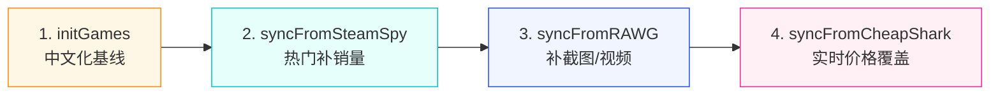

# 云函数目录

> 本目录存放所有微信云开发云函数。

## 📦 函数清单

### 业务函数

| 函数 | 用途 | 触发方式 |
|---|---|---|
| [`login/`](./login) | 微信登录，自动建档 | 小程序前端调用 |
| [`userProfile/`](./userProfile) | 用户资料 get/update（昵称变更走内容安全审核） | 小程序前端调用 |
| [`getGameList/`](./getGameList) | 首页游戏列表（含 mock 兜底，支持 rating/new/hot/discount/sales 排序） | 小程序前端调用 |
| [`getGameDetail/`](./getGameDetail) | 游戏详情 + 浏览历史上报 + 相关推荐 | 小程序前端调用 |
| [`searchGames/`](./searchGames) | 搜索游戏（search/hot/suggest 三 action） | 小程序前端调用 |
| [`favorite/`](./favorite) | 收藏 CRUD（add/remove/list/toggle/updateStatus） | 小程序前端调用 |
| [`history/`](./history) | 浏览历史 list/clear/remove（report 在 getGameDetail 内完成） | 小程序前端调用 |
| [`contentCheck/`](./contentCheck) | 内容安全审核（封装 msgSecCheck V2 + imgSecCheck，需 openapi 权限） | 云函数互调 / 前端 |

### 数据同步函数（管理端）

| 函数 | 数据源 | 是否需 Key | 用途 |
|---|---|---|---|
| [`initGames/`](./initGames) | 内置种子 | ❌ | 一键导入 25 款精选中文游戏 |
| [`syncFromSteamSpy/`](./syncFromSteamSpy) | [SteamSpy](https://steamspy.com/api.php) | ❌ | 拉取 Steam 热门游戏（销量、评分） |
| [`syncFromCheapShark/`](./syncFromCheapShark) | [CheapShark](https://apidocs.cheapshark.com) | ❌ | 实时打折信息 |
| [`syncFromRAWG/`](./syncFromRAWG) | [RAWG.io](https://rawg.io/apidocs) | ✅ 免费 | 截图、视频、标签、详细元数据 |
| [`syncAllSources/`](./syncAllSources) | 全部 | - | **一键聚合调度** |

---

## 🚀 首次部署完整流程

### 1. 前置：开通云开发

详见项目根 README，需先把 `appid` 替换为真实 AppID，并在微信开发者工具开通云开发环境。

### 2. 安装依赖（每个云函数目录都要执行一次）

在微信开发者工具中右键云函数目录 → **"在终端中打开"**：

```bash
cd cloudfunctions/login && npm install
cd cloudfunctions/userProfile && npm install
cd cloudfunctions/getGameList && npm install
cd cloudfunctions/getGameDetail && npm install
cd cloudfunctions/searchGames && npm install
cd cloudfunctions/favorite && npm install
cd cloudfunctions/history && npm install
cd cloudfunctions/contentCheck && npm install
cd cloudfunctions/initGames && npm install
cd cloudfunctions/syncFromSteamSpy && npm install
cd cloudfunctions/syncFromCheapShark && npm install
cd cloudfunctions/syncFromRAWG && npm install
cd cloudfunctions/syncFromSteamStore && npm install
cd cloudfunctions/syncAllSources && npm install
```

> 或更简单：在每个云函数目录右键 → **"上传并部署：云端安装依赖"**。

### 3. 部署云函数

在微信开发者工具中**逐个**右键云函数目录 → **"上传并部署：云端安装依赖（不上传 node_modules）"**。

### 4. 在云开发控制台创建集合

控制台 → 数据库 → 新建集合，**直接选简单预设权限**（无需写 JSON 规则）：

| 集合 | 权限预设 |
|---|---|
| `users` | 仅创建者可读写 |
| `games` | 所有用户可读，仅管理端可写 |
| `categories` | 所有用户可读，仅管理端可写 |
| `banners` | 所有用户可读，仅管理端可写 |
| `favorites` | 仅创建者可读写 |
| `history` | 仅创建者可读写 |

> 详细说明见 [`docs/DESIGN.md` §7.4](../docs/DESIGN.md)。

### 5. （可选）配置 RAWG API Key

如果要用 RAWG 同步详细数据：

1. 注册 https://rawg.io/apidocs 获取免费 API Key（每月 20,000 次调用配额）
2. 云开发控制台 → 云函数 → `syncFromRAWG` → 配置 → **环境变量** → 新增 `RAWG_API_KEY=你的key`

---

## 🎯 推荐的数据同步流程



### 方式 A：手动逐个跑（首次推荐）

在控制台 → 云函数 → 选择函数 → **云端测试** → 直接调用。

### 方式 B：一键全跑（推荐）

调用 `syncAllSources`，自动按顺序执行所有同步：

```json
{}
```

可选参数：

```json
// 只跑指定的
{ "only": ["initGames", "syncFromCheapShark"] }

// 跳过指定的
{ "skip": ["syncFromRAWG"] }
```

### 方式 C：定时自动同步（生产推荐）

为 `syncAllSources` 配置定时触发器（每天凌晨 3 点跑）：

在 `cloudfunctions/syncAllSources/` 下新建 `config.json`：

```json
{
  "triggers": [
    {
      "name": "dailySync",
      "type": "timer",
      "config": "0 0 3 * * * *"
    }
  ]
}
```

或在云开发控制台 → 云函数 → 触发器 → 添加 Cron 触发器。

---

## 🧬 数据合并策略

多个数据源同时写一个游戏（按 `externalIds.steam` 去重）时，字段合并策略：

| 字段 | 优先级 |
|---|---|
| 中文名 / 中文描述 | seed（initGames） > 不覆盖 |
| 价格 / 折扣 | CheapShark（实时） > SteamSpy > seed |
| 评分 / 销量 | SteamSpy > seed |
| 截图 / 视频 / 标签 | RAWG > seed > SteamSpy |
| 用户产出（收藏、浏览） | 永远不覆盖 |

每个游戏的 `dataSources` 字段会记录所有同步过的源，`lastSyncedAt` 记录各源最后同步时间，便于排查。

---

## 🐛 常见问题

| 现象 | 排查 |
|---|---|
| 云函数报「DATABASE_PERMISSION_DENIED」 | 在云开发控制台为对应集合开放写权限 |
| SteamSpy/CheapShark 超时 | 国内云函数访问境外有时不稳，重试即可 |
| RAWG 报「未配置 RAWG_API_KEY」 | 见第 5 步配置环境变量 |
| 中文名被覆盖了 | 检查游戏的 `dataSources` 是否包含 `seed` |

---

## 📚 相关文档

- [设计文档](../docs/DESIGN.md)
- [开发规划](../docs/ROADMAP.md)
- [微信云开发官方文档](https://developers.weixin.qq.com/miniprogram/dev/wxcloud/basis/getting-started.html)
