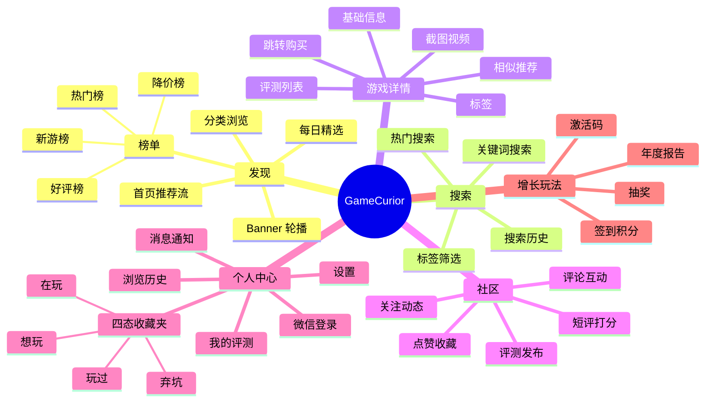
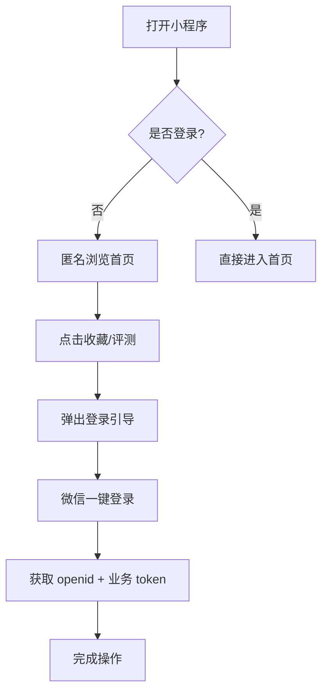
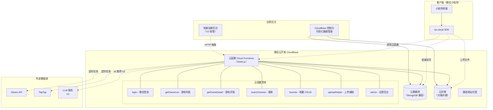
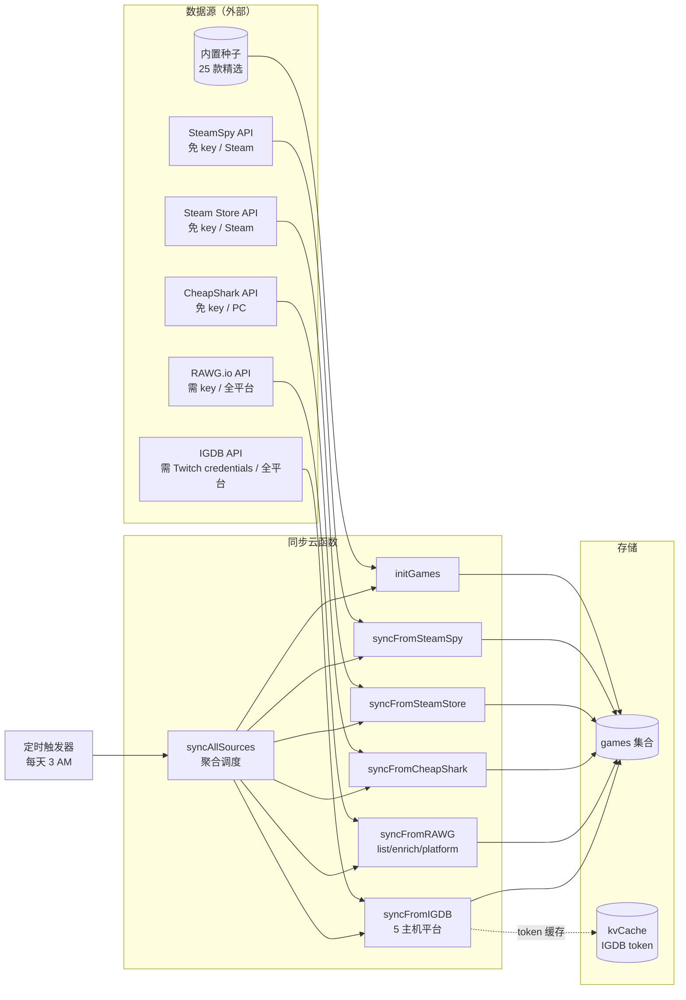
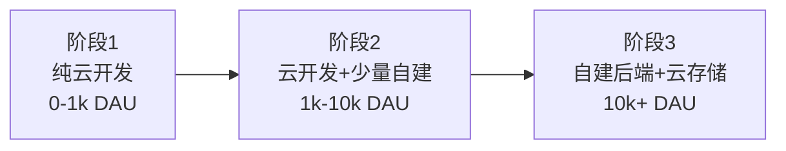

# GameCurior 微信小程序 · 设计文档

> 版本：v0.2
> 状态：草案，可迭代
> 维护：朱宇乔
> 最后更新：2026-05-29
> 变更：v0.2 后端方案改为 **微信云开发 CloudBase**（团队规模 1 人 + AI 决策）

---

## 目录

1. [产品概述](#1-产品概述)
2. [产品定位与目标用户](#2-产品定位与目标用户)
3. [功能架构](#3-功能架构)
4. [信息架构与页面结构](#4-信息架构与页面结构)
5. [核心用户流程](#5-核心用户流程)
6. [技术架构](#6-技术架构)
7. [数据模型设计](#7-数据模型设计)
8. [接口设计（API 概览）](#8-接口设计api-概览)
9. [非功能性需求](#9-非功能性需求)
10. [合规与安全设计](#10-合规与安全设计)
11. [关键技术决策](#11-关键技术决策)
12. [风险与未决问题](#12-风险与未决问题)

---

## 1. 产品概述

### 1.1 项目名称
- **中文名**：GameCurior（游戏策展人）
- **英文名**：GameCurior
- **形态**：微信小程序（暂不规划 App / H5）

### 1.2 一句话介绍
> 一个面向**轻度到中度玩家**的游戏发现与策展工具，帮助用户"**逛、发现、收藏、分享**"自己感兴趣的游戏。

### 1.3 项目愿景
- 成为玩家在选游戏时打开的**第一个微信入口**
- 用「**编辑精选 + 社区评测 + AI 推荐**」三轮驱动建立内容壁垒
- 中长期通过 CPS 联运、厂商推广实现商业化

---

## 2. 产品定位与目标用户

### 2.1 产品定位

| 维度 | 定位 |
|---|---|
| 内容形态 | 游戏百科 + 评测社区 + 个性化推荐 |
| 平台范围 | 优先覆盖 Steam、TapTap、主机平台，移动端选游为主 |
| 差异化 | 微信生态轻量、AI 策展、四态收藏夹 |
| 竞品参考 | TapTap、小黑盒、SteamDB、IGN |

### 2.2 目标用户画像

| 类型 | 占比预估 | 核心诉求 |
|---|---|---|
| **核心玩家**（深度独立 / 主机用户） | 20% | 找冷门佳作、看深度评测 |
| **泛玩家**（手游为主，偶尔玩 PC） | 60% | 看推荐、看口碑、买打折游戏 |
| **吃瓜玩家**（爱看不爱玩） | 20% | 看专题、看视频、参与话题 |

### 2.3 核心价值主张
- **省时间**：每天 3 分钟知道有哪些新游戏值得关注
- **避雷**：通过真实评测决定要不要买
- **个性化**：根据画像推荐你可能喜欢但没听过的游戏

---

## 3. 功能架构

### 3.1 功能脑图



### 3.2 功能矩阵与优先级

| 模块 | 功能 | MVP | V2 | V3 |
|---|---|:-:|:-:|:-:|
| 首页 | Banner / 每日精选 / 分类入口 | ✅ | | |
| 首页 | 个性化推荐流 | | | ✅ |
| 搜索 | 关键词 + 历史 + 热搜 | ✅ | | |
| 搜索 | 高级筛选（标签、价格、评分） | | ✅ | |
| 游戏 | 列表、详情、截图视频 | ✅ | | |
| 游戏 | 相似推荐 | | ✅ | |
| 榜单 | 热门 / 新游 / 好评 / 降价 | | ✅ | |
| 社区 | 评测发布、短评打分 | | ✅ | |
| 社区 | 评论、关注、动态流 | | | ✅ |
| 收藏 | 简单收藏 | ✅ | | |
| 收藏 | 四态收藏夹 + 自定义收藏夹 | | ✅ | |
| 通知 | 站内消息 | | ✅ | |
| 通知 | 微信订阅消息（降价/发售） | | ✅ | |
| AI | 智能推荐 + 对话推荐 | | | ✅ |
| 增长 | 签到 / 积分 / 抽奖 | | | ✅ |
| 商业化 | CPS 跳转外链 | | ✅ | |
| 商业化 | 厂商付费推广位 | | | ✅ |

---

## 4. 信息架构与页面结构

### 4.1 页面层级

```
小程序
├── TabBar（3 个）
│   ├── 发现（首页）       pages/index/index
│   ├── 榜单              pages/rank/rank        [V2]
│   └── 我的              pages/mine/mine
│
├── 子页面
│   ├── 游戏详情          pages/game/detail       [MVP]
│   ├── 游戏列表 / 分类页  pages/game/list         [MVP]
│   ├── 搜索页            pages/search/search     [MVP]
│   ├── 搜索结果页        pages/search/result     [MVP]
│   ├── 评测详情          pages/review/detail     [V2]
│   ├── 评测发布          pages/review/edit       [V2]
│   ├── 用户主页          pages/user/profile      [V3]
│   ├── 收藏夹            pages/mine/favorites    [MVP]
│   ├── 浏览历史          pages/mine/history      [MVP]
│   ├── 消息中心          pages/mine/notification [V2]
│   ├── 设置              pages/mine/setting      [MVP]
│   └── WebView 中转      pages/webview/index     [MVP]
```

### 4.2 分包策略

```
主包（≤ 2MB）
├── pages/index           首页
├── pages/mine            个人中心入口
├── pages/login           登录
└── utils / components    公共代码

subpkg-game/              游戏分包
├── pages/game/list
├── pages/game/detail
└── pages/search/*

subpkg-review/            评测分包 [V2]
├── pages/review/detail
└── pages/review/edit

subpkg-user/              用户分包 [V2]
├── pages/user/profile
└── pages/mine/notification
```

---

## 5. 核心用户流程

### 5.1 新用户首次进入



### 5.2 游戏发现 → 收藏

```mermaid
flowchart LR
    A[首页推荐流] --> B[点击游戏卡片]
    B --> C[游戏详情页]
    C --> D{用户决策}
    D -->|有兴趣| E[加入"想玩"]
    D -->|已购买| F[加入"在玩"]
    D -->|想分享| G[转发好友/朋友圈]
    D -->|想买| H[跳 WebView/复制链接]
    E --> I[首页提示已收藏]
```

### 5.3 评测发布流程（V2）

```mermaid
flowchart TD
    A[游戏详情页] --> B[点击"写评测"]
    B --> C{是否登录?}
    C -- 否 --> D[登录]
    C -- 是 --> E[评测编辑页]
    E --> F[输入正文+图片+打分]
    F --> G[本地敏感词预检]
    G --> H[上传图片到 OSS]
    H --> I[提交评测]
    I --> J[后端 MsgSecCheck/ImgSecCheck]
    J -- 通过 --> K[发布成功]
    J -- 不通过 --> L[隐藏+人工复审]
```

---

## 6. 技术架构

### 6.1 整体架构图（基于微信云开发 CloudBase）

> **核心决策**：MVP 与 V2 阶段采用 **微信云开发（CloudBase）** 方案，**零运维、零部署**，由 1 人 + AI 即可维护。V3 阶段视业务规模决定是否升级为自建后端。



**架构特点**：

- 无需服务器、域名、HTTPS 证书、Nginx、CI/CD
- 小程序直接通过 `wx.cloud.callFunction` 调用云函数，**免域名白名单配置**
- 云函数能直接拿到调用方 `OPENID`、`APPID`，登录免开发
- 鉴权、限流、日志由腾讯云托管
- 数据库使用 **MongoDB 兼容的文档数据库**，无需提前建表

### 6.2 技术选型

| 层 | MVP / V2（云开发方案） | V3（升级方案，可选） |
|---|---|---|
| 后端形态 | **微信云开发云函数** | 自建 Node.js (NestJS) |
| 后端语言 | Node.js 18+ | Node.js / Go |
| 数据库 | **云数据库（MongoDB 兼容）** | MySQL 8 + Redis |
| 搜索 | 数据库内置查询 + 内存倒排 | Elasticsearch 8 |
| 对象存储 | **云开发云存储** | 腾讯云 COS + CDN |
| 部署 | **微信开发者工具一键部署** | Docker + K8s |
| 鉴权 | 云函数自带 OPENID | JWT 自实现 |
| 任务调度 | **云函数定时触发器** | xxl-job |
| 监控 | **CloudBase 控制台** | Prometheus + Grafana |
| 后台 | **CloudBase 控制台 + Ant Design Pro 轻量定制** | 完整 CMS |
| 域名/SSL | **无需** | 自购 + 备案 |

### 6.3 前后端调用方式

```javascript
// 小程序端：调用云函数
const { result } = await wx.cloud.callFunction({
  name: 'getGameList',
  data: { page: 1, pageSize: 20, categoryId: 'action' }
});

// 云函数端：拿到 openid + 业务参数
exports.main = async (event, context) => {
  const { OPENID, APPID } = cloud.getWXContext();
  const { page, pageSize, categoryId } = event;
  // 查询云数据库
  const db = cloud.database();
  return await db.collection('games')
    .where({ categoryId })
    .skip((page - 1) * pageSize)
    .limit(pageSize)
    .get();
};
```

### 6.4 数据采集架构（多源融合）

> **核心思路**：游戏数据**不靠人工录入**，通过云函数从多个公开 API 自动同步并融合。

#### 数据源矩阵

| 数据源 | 是否需 Key | 主要贡献字段 | 平台覆盖 | 同步频率 |
|---|---|---|---|---|
| **内置种子**（`initGames`） | ❌ | 中文名、中文描述、分类 | Steam 主 | 一次性，仅在新增游戏时 |
| **SteamSpy** | ❌ | 销量、好评率、综合评分 | Steam | 每周 1 次（腾讯云 IP 被 Cloudflare 拦截，已部分失效） |
| **SteamStore** | ❌ | Steam 详细字段（语言/Metacritic/截图） | Steam | 每天 1 次（限速 3 个/次） |
| **CheapShark** | ❌ | 实时价格、折扣、商店链接 | PC 多商店 | 每天 1 次 |
| **RAWG.io** | ✅ 免费 | 截图、视频、详细标签、元数据；按平台拉主机榜单 | **全平台**（PS/Xbox/Switch/PC/移动） | 按需触发 + 5 平台日榜 |
| **IGDB (Twitch)** | ✅ 免费 | 主机独占 + 冷门 / 日韩游戏兜底，元数据最权威 | **全平台**，含日韩独占 | 每天 1 次（5 平台合一） |

#### 数据流图



#### 字段合并策略

多个数据源同时写入同一款游戏（按 `externalIds.steam` 去重）时：

| 字段 | 合并优先级 |
|---|---|
| 中文名 / 中文描述 | `initGames > 不覆盖` |
| 价格 / 折扣 | `CheapShark > SteamStore > SteamSpy > Seed`；**IGDB 不写价格**（避免误清空） |
| 评分 / 销量 | `Math.max(已有, 新值)`（IGDB / SteamSpy 都参与，取高分） |
| 截图 / 视频 / 标签 | `IGDB（最权威） > RAWG > Seed > SteamSpy` |
| 主机平台数据 | `IGDB > RAWG`（按平台榜单同步：Switch/PS5/PS4/XboxS/Xbox1） |
| 用户产出（收藏、浏览） | **永远不被同步覆盖** |

#### 文档元数据

每个游戏记录都带：

```js
{
  dataSources: ['seed', 'steamspy', 'steamstore', 'cheapshark', 'rawg', 'igdb'],  // 来源追踪
  lastSyncedAt: {
    seed: Date,
    steamspy: Date,
    steamstore: Date,
    cheapshark: Date,
    rawg: Date,
    igdb: Date,
  },
  externalIds: {
    steam: '1145360',     // SteamStore / SteamSpy / CheapShark 去重锚
    rawg: '54',           // RAWG 兜底去重
    igdb: '5328',         // IGDB 兜底去重
  },
}
```

便于排查、重跑、增量更新。

### 6.5 演进路径（避免厂商锁定）



| 阶段 | 架构 | 月成本预估 | 触发条件 |
|---|---|---|---|
| 阶段 1 | 纯云开发（基础版 19 元套餐） | ¥0-200 | 默认起步 |
| 阶段 2 | 云开发 + 自建搜索/推荐服务 | ¥300-800 | DAU > 1k 或需复杂查询 |
| 阶段 3 | 自建 NestJS + 云存储 + 云数据库迁 MySQL | ¥800-2000 | DAU > 10k 或需精细化优化 |

### 6.6 前端技术栈

| 项 | 选型 |
|---|---|
| 框架 | 微信原生小程序（不引入 Taro / uni-app） |
| UI 组件 | [Vant Weapp](https://vant-contrib.gitee.io/vant-weapp/) |
| 状态管理 | [mobx-miniprogram](https://github.com/wechat-miniprogram/mobx-miniprogram) |
| 云开发调用 | 自封装 `utils/cloud.js`（统一调用、错误处理、loading） |
| 工具库 | dayjs、lodash-es（按需引入） |
| 构建优化 | 分包 + 图片懒加载 + WebP |

---

## 7. 数据模型设计

> **说明**：MVP 使用云开发的**云数据库（MongoDB 兼容）**，因此采用**文档型**结构设计。下方用"集合 (Collection) + 文档结构 (Schema)"的方式描述。未来升级到 MySQL 时可参考附录中的关系型映射。

### 7.1 集合（Collection）总览

| 集合名 | 用途 | 阶段 |
|---|---|---|
| `users` | 用户信息 | MVP |
| `games` | 游戏数据 | MVP |
| `categories` | 分类 | MVP |
| `tags` | 标签 | MVP |
| `favorites` | 收藏 | MVP |
| `history` | 浏览历史 | MVP |
| `banners` | 首页 Banner | MVP |
| `reviews` | 用户评测 | V2 |
| `ratings` | 评分记录 | V2 |
| `comments` | 评论 | V2 |
| `likes` | 点赞 | V2 |
| `notifications` | 站内消息 | V2 |
| `subscriptions` | 订阅消息记录 | V2 |

### 7.2 关键 Schema 设计

#### `users` 用户
```js
{
  _id: "auto",            // 云开发自动生成
  _openid: "oXXX",        // 云开发自动注入，作为主键
  unionid: "uXXX",        // 可选
  nickname: "玩家001",
  avatar: "cloud://xxx",
  phone: "",              // 绑定后填
  preferences: {          // 用户偏好
    categories: ["action", "rpg"],
    platforms: ["steam"]
  },
  status: 0,              // 0 正常 / 1 封禁
  createdAt: Date,
  updatedAt: Date
}
```

> 云开发默认所有写操作都会注入 `_openid`，可直接用 `db.collection('users').where({ _openid: '{openid}' })` 查当前用户数据。

#### `games` 游戏
```js
{
  _id: "auto",
  name: "Hades",
  nameEn: "Hades",
  cover: "cloud://xxx/cover.jpg",
  description: "一款超凡的 roguelike 地牢爬行...",
  rating: 9.6,
  ratingCount: 12380,
  price: 79.00,
  originalPrice: 98.00,
  categoryId: "cat_action",
  tags: ["roguelike", "动作", "独立"],     // 直接内嵌，省一次 JOIN
  platforms: ["steam", "switch"],
  developer: "Supergiant Games",
  publisher: "Supergiant Games",
  releasedAt: "2020-09-17",
  screenshots: [
    "cloud://xxx/s1.jpg",
    "cloud://xxx/s2.jpg"
  ],
  videos: [
    { url: "cloud://xxx/v1.mp4", cover: "cloud://xxx/vc1.jpg" }
  ],
  externalLinks: {
    steam: "https://store.steampowered.com/app/1145360/",
    taptap: "https://www.taptap.cn/app/xxx"
  },
  // 统计冗余字段（避免每次 count）
  stats: {
    favCount: 0,
    reviewCount: 0,
    viewCount: 0
  },
  status: 1,              // 0 草稿 / 1 上架 / 2 下架
  createdAt: Date,
  updatedAt: Date
}
```

#### `categories` 分类
```js
{
  _id: "cat_action",      // 自定义可读 ID
  name: "动作",
  parentId: null,
  icon: "cloud://xxx",
  sort: 1
}
```

#### `favorites` 收藏
```js
{
  _id: "auto",
  _openid: "oXXX",        // 谁收藏
  gameId: "game_xxx",
  status: 0,              // 0 想玩 / 1 在玩 / 2 玩过 / 3 弃坑
  createdAt: Date
}
// 索引：复合唯一索引 (_openid, gameId)
```

#### `history` 浏览历史
```js
{
  _id: "auto",
  _openid: "oXXX",
  gameId: "game_xxx",
  viewedAt: Date
}
// 索引：(_openid, viewedAt desc)，并按用户保留最近 200 条（云函数定时清理）
```

#### `banners` 首页 Banner
```js
{
  _id: "auto",
  title: "夏日特惠",
  image: "cloud://xxx",
  linkType: "game",       // game / article / external
  linkValue: "game_xxx",
  sort: 1,
  startAt: Date,
  endAt: Date,
  status: 1
}
```

#### `reviews` 评测（V2）
```js
{
  _id: "auto",
  _openid: "oXXX",
  gameId: "game_xxx",
  content: "...",         // 富文本
  score: 9,               // 1-10
  images: ["cloud://..."],
  likeCount: 0,
  commentCount: 0,
  auditStatus: 0,         // 0 待审 / 1 通过 / 2 拒绝
  createdAt: Date
}
```

### 7.3 索引设计

| 集合 | 索引 | 类型 | 说明 |
|---|---|---|---|
| users | `_openid` | 唯一 | 云开发默认 |
| games | `status, rating desc` | 复合 | 上架游戏按评分排序 |
| games | `categoryId, status` | 复合 | 分类筛选 |
| games | `tags`（multi-key） | 复合 | 标签筛选 |
| favorites | `(_openid, gameId)` | 复合唯一 | 防重复收藏 |
| favorites | `(_openid, status, createdAt desc)` | 复合 | 收藏列表查询 |
| history | `(_openid, viewedAt desc)` | 复合 | 历史列表 |
| reviews | `(gameId, auditStatus, createdAt desc)` | 复合 | 游戏评测列表 |

### 7.4 数据库权限配置

> 云开发提供 **4 种简单预设权限**，MVP 阶段全部用预设即可，**无需写 JSON 安全规则**。
> 只有评测系统等复杂场景（V2 阶段）才需要自定义 JSON。

#### 简单预设权限（图形化下拉框）

| 预设 | 客户端读 | 客户端写 | 云函数 |
|---|---|---|---|
| 所有用户可读，仅创建者可读写 | 任何人 | 仅创建者改自己 | 全权 |
| 仅创建者可读写 | 仅创建者读自己 | 仅创建者改自己 | 全权 |
| **所有用户可读，仅管理端可写** | 任何人 | ❌ 必须走云函数 | 全权 |
| **仅管理端可读写** | ❌ 必须走云函数 | ❌ 必须走云函数 | 全权 |

#### MVP 集合权限对照

| 集合 | 推荐预设 | 备注 |
|---|---|---|
| `users` | 仅创建者可读写 | 用户只看自己的资料 |
| `games` | **所有用户可读，仅管理端可写** | 客户端直接读列表，写入仅云函数 |
| `categories` | **所有用户可读，仅管理端可写** | 同上 |
| `banners` | **所有用户可读，仅管理端可写** | 同上 |
| `favorites` | 仅创建者可读写 | 只看自己的收藏 |
| `history` | 仅创建者可读写 | 只看自己的浏览历史 |

> 在云开发控制台 → 数据库 → 选中集合 → 数据权限 → 选预设即可，零代码。

#### V2 阶段：评测系统需要自定义 JSON 规则

`reviews` 集合的需求："已审通过的所有人可读，待审的只有作者可读，只有作者可写"，预设搞不定，必须用安全规则：

```json
{
  "read": "doc.auditStatus == 1 || doc._openid == auth.openid",
  "write": "doc._openid == auth.openid"
}
```

或者更简单：把 `reviews` 设为「**仅管理端可读写**」，所有读写都通过云函数控制审核状态。

### 7.5 关系型升级映射（未来 V3 迁 MySQL 时参考）

| 文档型集合 | 关系型表 | 字段拆分说明 |
|---|---|---|
| `games.tags`（数组） | `tags` + `game_tags` 关系表 | 多对多打平 |
| `games.screenshots`（数组） | `game_screenshots` 表 | 一对多打平 |
| `games.stats`（嵌套对象） | 单独冗余字段 | 拆开存 |
| `_openid` | `users.openid` UK | 仍作为业务主键 |

---

## 8. 接口设计（API 概览）

### 8.1 通用约定（云开发版本）

- **调用方式**：通过 [`wx.cloud.callFunction`](https://developers.weixin.qq.com/miniprogram/dev/wxcloud/reference-sdk-api/functions/Cloud.callFunction.html) 调用云函数
- **鉴权**：自动通过云开发上下文获取 `OPENID`，无需手动传 token
- **统一响应结构**（云函数返回值）：

```js
{
  code: 0,           // 0 成功，非 0 失败
  message: "ok",
  data: { },
  requestId: "..."   // 云函数 context.requestId
}
```

- **错误码**：

| Code | 含义 |
|---|---|
| 0 | 成功 |
| 1xxx | 客户端错误（参数、登录态） |
| 2xxx | 业务错误 |
| 5xxx | 服务端错误（云函数异常） |

### 8.2 MVP 云函数清单

| 云函数名 | action 参数 | 说明 | 备注 |
|---|---|---|---|
| `login` | - | 微信登录，初始化用户记录 | 自动获取 openid |
| `userProfile` | `get` / `update` | 获取/更新个人信息 | |
| `getGameList` | - | 游戏列表（分页 / 筛选） | |
| `getGameDetail` | - | 游戏详情 | 顺带上报历史 |
| `searchGames` | - | 搜索游戏 + 热搜 / 联想 | |
| `getCategories` | - | 分类树 | 可缓存到客户端 |
| `favorite` | `add` / `remove` / `list` / `updateStatus` | 收藏 CRUD | 多 action 复用 |
| `history` | `report` / `list` / `clear` | 浏览历史 | |
| `getHomeConfig` | - | 首页 Banner + 推荐位 | 可缓存到客户端 |
| `uploadHelper` | - | 返回上传所需信息 | 客户端可直接用 `wx.cloud.uploadFile` |

> **设计原则**：相关操作（如收藏的增删改查）合并到一个云函数内，通过 `action` 参数路由，减少云函数数量、降低成本。

### 8.3 调用示例：游戏列表

**小程序端调用**

```js
const { result } = await wx.cloud.callFunction({
  name: 'getGameList',
  data: {
    page: 1,
    pageSize: 20,
    categoryId: 'cat_action',
    sort: 'rating'      // rating / new / hot
  }
});

if (result.code === 0) {
  this.setData({ list: result.data.list });
}
```

**云函数端实现（示例）**

```js
const cloud = require('wx-server-sdk');
cloud.init({ env: cloud.DYNAMIC_CURRENT_ENV });
const db = cloud.database();
const _ = db.command;

exports.main = async (event, context) => {
  const { OPENID } = cloud.getWXContext();
  const { page = 1, pageSize = 20, categoryId, sort = 'rating' } = event;

  const where = { status: 1 };
  if (categoryId) where.categoryId = categoryId;

  const sortMap = {
    rating: { rating: -1 },
    new: { releasedAt: -1 },
    hot: { 'stats.viewCount': -1 }
  };

  try {
    const { data } = await db.collection('games')
      .where(where)
      .orderBy(...Object.entries(sortMap[sort])[0])
      .skip((page - 1) * pageSize)
      .limit(pageSize)
      .get();

    return {
      code: 0,
      message: 'ok',
      data: { list: data, page, pageSize }
    };
  } catch (err) {
    return { code: 5000, message: err.message, data: null };
  }
};
```

### 8.4 客户端可直接读云数据库（部分场景）

对于**简单查询**（如分类列表、Banner 列表），可省略云函数，**直接走云数据库 SDK**，性能更好、成本更低：

```js
const db = wx.cloud.database();
const { data } = await db.collection('categories')
  .orderBy('sort', 'asc')
  .get();
```

> 这种方式需要在云开发控制台为对应集合配置正确的**安全规则**（见 §7.4）。

---

## 9. 非功能性需求

### 9.1 性能指标

| 指标 | MVP | V2 |
|---|---|---|
| 首屏 TTI | < 1.5s | < 1s |
| 接口 P95 | < 500ms | < 300ms |
| 接口 P99 | < 1s | < 500ms |
| 错误率 | < 0.5% | < 0.1% |
| DAU 承载 | 1w | 50w |
| 并发 QPS | 200 | 5000 |

### 9.2 兼容性

- 微信小程序基础库：≥ 2.32.0
- iOS：iOS 12+
- Android：Android 7+

### 9.3 可用性
- 核心接口 SLA：99.9%
- 监控告警 5 分钟内响应

---

## 10. 合规与安全设计

### 10.1 合规要求

| 项 | 措施 |
|---|---|
| 小程序类目 | 选 **"工具 / 资讯类"**，规避"游戏"主类目资质门槛 |
| 隐私政策 | 在首次启动 / 登录前展示《用户协议》《隐私政策》 |
| 个人信息收集 | 遵循最小必要原则，明示用途 |
| 用户内容 | 全部走 MsgSecCheck / ImgSecCheck（云函数调用 `cloud.openapi.security.*`） |
| 备案 | 云开发免域名备案；小程序本身需要做小程序备案 |

### 10.2 安全设计（云开发版本）

| 类别 | 措施 |
|---|---|
| 传输安全 | 云开发自动 HTTPS，无需自配 SSL |
| 鉴权 | 云函数自动注入 `OPENID`，无需 JWT |
| 数据库权限 | 通过**云数据库安全规则**控制读写（见 §7.4） |
| 接口防刷 | 云函数内基于 `OPENID` 做计数限流，结合云开发并发上限 |
| 防爬 | 云开发免域名，第三方难以直接调用 |
| 防注入 | 云数据库使用 MongoDB 查询构造器，无 SQL 注入风险 |
| XSS | 富文本统一过滤白名单标签 |
| 敏感词 | DFA 算法本地预检 + 云函数调用 `security.msgSecCheck` |

---

## 11. 关键技术决策

| 决策点 | 选项 | 选择 | 理由 |
|---|---|---|---|
| 前端框架 | 原生 / Taro / uni-app | **原生** | 简单稳定，性能最佳，无构建坑 |
| UI 组件 | Vant Weapp / TDesign | **Vant Weapp** | 生态成熟、文档清晰 |
| 后端方案 | 云开发 / 自建 ECS / Serverless | **微信云开发（CloudBase）** | 1 人 + AI 团队，零运维优先 |
| 后端语言 | Node / Go / Java | **Node.js 18+** | 云开发原生支持，生态全 |
| 数据库 | 云数据库 / MySQL | **云数据库（MongoDB 兼容）** | 与云开发无缝集成，文档型适配灵活 Schema |
| 存储 | 云存储 / 自建 COS | **云开发云存储** | 与云开发无缝集成，自带 CDN |
| 搜索 | 数据库查询 / ES | **MVP 用数据库，V2 视情况切 ES** | 控制初期复杂度 |
| 鉴权方案 | JWT / 云开发 OPENID | **云开发 OPENID** | 免开发、免维护 |
| 后台管理 | 自建 CMS / CloudBase 控制台 | **CloudBase 控制台 + 轻量自建** | 大幅减少前期工作 |
| 推荐 | 规则 / CF / 深度模型 | **MVP 规则，V2 CF，V3 LLM** | 渐进式投入 |
| 演进策略 | 单体演进 / 微服务 | **云函数 → 自建服务（V3 可选）** | 控制成本与复杂度 |

---

## 12. 风险与未决问题

### 12.1 已知风险

| 风险 | 等级 | 缓解措施 |
|---|---|---|
| 微信类目审核被拒 | 高 | 申请前先按"工具/资讯"准备材料 |
| Steam / TapTap 数据爬取合规 | 中 | 优先用官方 API，控制频率，加缓存 |
| UGC 内容违规导致下架 | 高 | 强制内容审核 + 24h 人工复审 |
| 编辑运营成本高 | 中 | MVP 阶段编辑产量 ≥ 5 篇/天，逐步过渡到 UGC |
| 冷启动用户少 | 高 | 联合游戏社群、KOL 试用、激活码抽奖引流 |

### 12.2 待定问题

- [ ] 是否需要 H5 落地页（用于朋友圈分享非小程序入口）？
- [ ] 是否支持账号体系（手机号注册）和微信账号并存？
- [ ] 编辑团队规模？外包 or 自建？
- [ ] 是否做主机平台支持（Switch、PS、Xbox）？
- [ ] 商业化时机点？DAU 达到多少启动？

---

## 附录：术语表

| 术语 | 含义 |
|---|---|
| MVP | Minimum Viable Product，最小可用版本 |
| UGC | User Generated Content，用户产生内容 |
| CPS | Cost Per Sale，按销售付费的联盟分成模式 |
| Curator | 策展人，本项目核心概念 |
| 四态收藏 | 想玩 / 在玩 / 玩过 / 弃坑，玩家管理游戏库的标准范式 |
| MsgSecCheck | 微信文本内容安全检测 API |
