# GameCurior 微信小程序 · 开发规划文档

> 版本：v0.2
> 状态：草案，可迭代
> 维护：朱宇乔
> 最后更新：2026-05-29
> 配套：[设计文档 DESIGN.md](./DESIGN.md)
> 变更：v0.2 调整为 **1 人 + AI** 团队规模 + **微信云开发** 后端方案

---

## 目录

1. [总体规划与里程碑](#1-总体规划与里程碑)
2. [团队与角色](#2-团队与角色)
3. [迭代节奏](#3-迭代节奏)
4. [V1.0 MVP 详细规划（8 周）](#4-v10-mvp-详细规划8-周)
5. [V2.0 社区版规划](#5-v20-社区版规划)
6. [V3.0 智能化版规划](#6-v30-智能化版规划)
7. [研发流程规范](#7-研发流程规范)
8. [质量保证](#8-质量保证)
9. [发布流程](#9-发布流程)
10. [风险管理](#10-风险管理)
11. [成本估算](#11-成本估算)

---

## 1. 总体规划与里程碑

> **节奏说明**：本项目为 **1 人 + AI** 独立开发模式，不设硬性 deadline。下表按"理想推进节奏"给出参考，可根据个人时间灵活调整（一周投入 10h vs 30h，差距可能 3 倍以上）。

### 1.1 整体路线图（按周计时，不绑日期）

```mermaid
gantt
    title GameCurior 整体路线图（按周）
    dateFormat X
    axisFormat W%s

    section V1.0 MVP
    需求确认 & 原型      :m1, 0, 1w
    云开发环境搭建       :m2, after m1, 1w
    小程序 MVP 开发      :m3, after m2, 4w
    内容录入 + 联调      :m4, after m3, 1w
    审核 & 上线          :m5, after m4, 1w

    section V2.0 社区
    社区功能开发         :m6, after m5, 5w
    灰度 & 优化          :m7, after m6, 1w

    section V3.0 智能
    AI 推荐建设          :m8, after m7, 6w
    商业化探索           :m9, after m8, 4w
```



### 1.2 关键里程碑

| 里程碑 | 大致时长 | 关键交付物 |
|---|---|---|
| **M0：项目启动** | Day 0 | 设计文档、规划文档、AppID 申请 |
| **M1：技术验证** | 第 2 周末 | 云开发跑通，能登录、能从云数据库读数据 |
| **M2：MVP 上线** | 第 7-8 周 | 通过微信审核，正式发布 |
| **M3：V2 上线** | 第 13-14 周 | 社区功能（评测、收藏夹、订阅） |
| **M4：V3 上线** | 第 23-24 周 | AI 推荐、增长玩法 |

### 1.3 阶段性目标（独立开发者预期）

| 阶段 | DAU 目标 | 留存目标 | 内容沉淀 |
|---|---|---|---|
| MVP 上线 | 50-200 | 次日 30% | 200+ 游戏 |
| V2 上线 | 500-2000 | 次日 40% | 1000+ 游戏 + 100+ 评测 |
| V3 上线 | 3000-10000 | 次日 45% | 3000+ 游戏 + 1000+ 评测 |

---

## 2. 团队与角色

### 2.1 实际配置：1 人 + AI

| 角色 | 由谁承担 | 协作方式 |
|---|---|---|
| 产品 / 设计 | 你 | 用 AI（Claude / GPT）辅助写 PRD、生成原型 |
| 小程序开发 | 你 + Codewiz | AI 写代码，你 Review 和联调 |
| 云函数开发 | 你 + Codewiz | AI 直接产出 |
| 数据库设计 | 你 + AI | AI 给 Schema 建议 |
| 内容录入 | 你 | 利用 CloudBase 控制台手动 + AI 辅助生成简介 |
| 测试 | 你 | 真机自测 |
| 运营 | 你 | 微信群、朋友圈、社区冷启动 |

**1 人 + AI 模式的注意事项**：
- **降低复杂度优先**：技术选型、UI 设计都偏向"够用就好"
- **能 AI 干的不自己干**：写文档、写文案、生成数据、写代码
- **每周复盘 1 次**：避免"埋头干活"忽略进度

### 2.2 协作工具（极简版）

| 用途 | 工具 | 说明 |
|---|---|---|
| 代码 | Git + GitHub/GitLab | 一个仓库管所有 |
| 任务管理 | TODO 列表 / Notion 看板 | 单人不需要 PingCode |
| 文档 | Markdown + 本仓库 `docs/` | 跟代码一起版本管理 |
| AI 编程 | Codewiz / Cursor / Claude Code | 主力编码助手 |
| 设计 | Figma 免费版 / 直接上 Vant 组件 | 不做精细视觉稿 |
| 监控 | CloudBase 控制台 | 自带，无需额外搭建 |
| 沟通 | 个人微信 / 内测群 | 收集用户反馈 |

### 2.3 时间投入预估（基于业余时间开发）

| 投入强度 | 每周时间 | MVP 完成预计 | V2 完成预计 |
|---|---|---|---|
| 轻量（业余） | 5-10h | 12-16 周 | 24-30 周 |
| **中等（推荐）** | 10-20h | **6-8 周** | **14-16 周** |
| 高强度（全职） | 30-40h | 3-4 周 | 8-10 周 |

---

## 3. 迭代节奏（1 人 + AI 模式）

### 3.1 周期定义

- **大版本**：MVP / V2 / V3，每个版本控制在 6-8 周完成
- **小迭代**：以"周"为单位，每周末复盘 + 调整
- **不设硬 deadline**：节奏跟个人精力走，但要避免拖延

### 3.2 一周建议节奏

```
工作日晚上（每天 1-2h）  写代码 / 联调 / 自测
周末上午（3-4h）         完成一个完整功能模块
周末下午                 内容运营、用户反馈处理
周日晚                   写本周复盘、规划下周任务
```

### 3.3 单人开发的关键原则

| 原则 | 说明 |
|---|---|
| **小步快跑** | 每天可发布、每周可演示 |
| **AI 优先** | 能用 AI 写的代码 / 文档 / 内容，不自己手写 |
| **能不做就不做** | 任何功能都先问"MVP 必需吗？" |
| **善用云能力** | 数据后台用 CloudBase 控制台，不自己写 CMS |
| **早发布早反馈** | 哪怕只有自己用，也要尽快发布拿数据 |

### 3.4 版本号规范

- 遵循 SemVer：`major.minor.patch`
- 例：`1.0.0` MVP / `1.1.0` 新功能 / `1.1.1` Bug 修复

---

## 4. V1.0 MVP 详细规划（6-8 周）

> **关键变化**：由于采用 **云开发** + **1 人 + AI** 模式，相比传统方案：
> - ✅ 砍掉服务器搭建、Docker、CI/CD、域名备案、SSL 配置
> - ✅ 用 CloudBase 控制台替代自建 CMS，省 5-7 天
> - ✅ 鉴权由云开发托管，省 2-3 天 JWT 开发
> - 总工时从原方案约 50 人日 → **约 20-25 人日**

### 4.1 周次拆分

| 周次 | 主题 | 交付 |
|---|---|---|
| Week 1 | 准备 & 环境搭建 | AppID 申请、云开发开通、设计稿 |
| Week 2 | 基础 + 登录 + 首页骨架 | 可登录、能看到首页 |
| Week 3 | 游戏详情 + 列表页 | 浏览闭环 |
| Week 4 | 搜索 + 收藏 + 历史 | 核心功能完成 |
| Week 5 | 个人中心 + 设置 + 优化 | 体验打磨 |
| Week 6 | 内容录入 + 联调测试 | 准备提审 |
| Week 7 | 微信审核 & 修复 | 上线 |
| Week 8（buffer） | 灰度优化 + 反馈处理 | 稳定运行 |

### 4.2 详细任务拆解

#### Week 1：准备 & 环境

**目标**：所有基础设施就位，可以开始写业务代码。

| 任务 | 工时 | 备注 |
|---|---|---|
| 完善 PRD（用 AI 辅助） | 0.5d | 已有 DESIGN.md 基础 |
| 出 4-5 张关键页面线框图 | 0.5d | Figma 或纸笔即可 |
| 申请微信小程序 AppID | 0.5d | 选「工具 / 资讯」类目 |
| 开通微信云开发环境 | 0.5d | 选基础版套餐（约 ¥19/月） |
| 替换 `project.config.json` 中的 AppID | 0.1d | |
| 配置云开发环境 ID | 0.1d | 在 app.js 初始化 |
| 准备 10 款测试游戏数据（图文） | 0.5d | 用 AI 生成简介 |

#### Week 2：登录 + 首页骨架

**目标**：用户能登录，能看到首页内容。

| 任务 | 工时 | 备注 |
|---|---|---|
| 引入 Vant Weapp（npm 包） | 0.3d | |
| 引入 mobx-miniprogram | 0.3d | 全局状态 |
| 封装 `utils/cloud.js`（统一调用云函数） | 0.3d | 已搭好脚手架 |
| 创建云函数 `login`（微信登录 + 创建用户） | 0.5d | |
| 在 `users` 集合录入第一条用户数据 | - | 自动 |
| 创建云函数 `getHomeConfig`（Banner + 分类） | 0.5d | |
| 创建云函数 `getGameList`（游戏列表） | 0.5d | |
| 首页 UI：Banner 轮播 + 分类入口 | 1d | |
| 首页 UI：游戏卡片瀑布流 | 1d | |
| 在 CloudBase 控制台录入 Banner 数据 | 0.2d | |

#### Week 3：游戏详情 + 列表页

| 任务 | 工时 | 备注 |
|---|---|---|
| 创建云函数 `getGameDetail`（详情 + 上报历史） | 0.5d | |
| 游戏详情页 UI（截图、视频、标签、价格） | 2d | |
| 详情页"跳转购买"（复制链接 + WebView 中转） | 0.5d | 合规要点 |
| 分类游戏列表页 | 1d | |
| 详情页"相关推荐" | 0.5d | 同类目随机 |

#### Week 4：搜索 + 收藏 + 历史

| 任务 | 工时 | 备注 |
|---|---|---|
| 创建云函数 `searchGames`（含拼音、热搜） | 1d | |
| 创建云函数 `favorite`（add/remove/list） | 0.5d | |
| 创建云函数 `history`（report/list） | 0.3d | |
| 搜索页（搜索框 + 历史 + 热搜） | 1d | |
| 搜索结果页 + 筛选 | 1d | |
| 收藏列表页 | 0.5d | |
| 浏览历史页 | 0.5d | |

#### Week 5：个人中心 + 优化

| 任务 | 工时 | 备注 |
|---|---|---|
| 个人中心改造（头像、昵称、菜单） | 1d | |
| 设置页（清缓存、关于我们、用户协议、隐私政策） | 1d | |
| 全局空态 / 错误态 / 骨架屏 | 1d | |
| 性能优化（分包、图片懒加载、缓存） | 1d | |
| 配置云数据库安全规则 | 0.5d | 参考 DESIGN §7.4 |

#### Week 6：内容 + 联调

| 任务 | 工时 | 备注 |
|---|---|---|
| 在 CloudBase 控制台录入 200+ 游戏 | 2d | AI 辅助生成简介、找图 |
| 完整流程自测（每个页面、每个按钮） | 2d | |
| Bug 修复 | 1-2d | |
| 撰写《用户协议》《隐私政策》页面 | 0.5d | AI 起草 |
| 接入内容安全（云函数调用 `msgSecCheck`） | 0.5d | |

#### Week 7：审核 & 上线

| 任务 | 工时 | 备注 |
|---|---|---|
| 真机多机型测试（iOS + Android） | 1d | |
| 准备审核材料 | 0.5d | 类目、隐私说明 |
| 提交微信审核 | 0.5d | 通常 1-3 天反馈 |
| 审核反馈修复（如有） | 1-2d | |
| 正式发布 + 朋友圈宣传 | 0.5d | |

### 4.3 MVP 功能清单（最终交付）

✅ 必须有：
- 微信登录
- 首页（Banner、分类、推荐流）
- 游戏详情页（截图、视频、跳转购买）
- 搜索（含历史和热搜）
- 收藏 / 取消收藏
- 浏览历史
- 个人中心 + 设置
- 数据后台（直接用 CloudBase 控制台，不自建）

❌ MVP **不做**：
- 评测、评论、点赞
- 关注、动态流
- 订阅消息推送
- 个性化推荐
- 积分、抽奖、签到
- 自建运营后台
- 多端登录（仅微信）

### 4.4 验收标准

- [ ] 能完成"打开 → 登录 → 浏览 → 收藏 → 跳转购买"完整闭环
- [ ] 200+ 真实游戏数据已录入
- [ ] 主流 iPhone / Android 机型无明显 bug
- [ ] 通过微信审核
- [ ] CloudBase 控制台监控看板能看到调用数据

---

## 5. V2.0 社区版规划

### 5.1 目标
- 完善社区生态，引入 UGC
- 提升用户留存和粘性

### 5.2 Sprint 拆分（6 周）

| Sprint | 主题 | 关键功能 |
|---|---|---|
| Sprint 4 | 评测系统 | 评测发布、列表、详情、打分 |
| Sprint 5 | 互动 + 通知 | 点赞、评论、订阅消息、消息中心 |
| Sprint 6 | 榜单 + 增强收藏 | 多维榜单、四态收藏夹、CPS 跳转 |

### 5.3 关键功能详情

#### 评测系统
- 富文本编辑器
- 图片上传（多图 + 压缩）
- 内容安全审核（MsgSec + ImgSec）
- 我的评测管理
- 评测列表（按热度 / 时间）

#### 互动 + 通知
- 通用点赞 / 评论
- 微信订阅消息：降价提醒、发售提醒
- 站内消息中心

#### 榜单
- 热门榜（综合）
- 新游榜（按发售日）
- 好评榜（按评分）
- 降价榜（按降价幅度）

---

## 6. V3.0 智能化版规划

### 6.1 目标
- AI 驱动的千人千面
- 商业化闭环跑通

### 6.2 关键能力

| 能力 | 技术方案 |
|---|---|
| 个性化推荐 | 协同过滤（CF）+ 用户画像 |
| 相似游戏 | i2i 向量召回（Faiss / Milvus） |
| AI 对话推荐 | LLM + RAG，游戏库做向量索引 |
| 关注 / 动态流 | 推拉结合方案 |
| 签到 / 积分 | 任务系统 + 积分商城 |
| 商业化 | 联运分成 + 厂商付费推广位 |

### 6.3 Sprint 拆分（8 周）

| Sprint | 主题 |
|---|---|
| Sprint 7 | 用户画像 + 数据看板 |
| Sprint 8 | 协同过滤推荐 |
| Sprint 9 | AI 对话推荐 |
| Sprint 10 | 增长玩法（签到、积分、抽奖） |

---

## 7. 研发流程规范（单人极简版）

### 7.1 分支策略

```
main      主分支，保持随时可上线状态
  └── feature/xxx   日常功能开发（合完即删）
```

> 单人开发不需要 develop / release 分支，每个功能在 `feature/xxx` 完成后直接合 `main`，打 tag 即可。

### 7.2 Commit 规范（Conventional Commits）

```
<type>(<scope>): <subject>

type: feat / fix / docs / style / refactor / chore
例: feat(home): 新增 Banner 轮播组件
```

### 7.3 Code Review

- 自己写自己 Review：合并前用 `git diff` 完整过一遍
- 关键改动让 **AI 帮你 Review**（贴代码给 Codewiz / Claude）
- 每周回顾时做一次"代码考古"，重构臃肿的部分

### 7.4 代码规范

| 项 | 工具 |
|---|---|
| JS Lint | ESLint + Prettier（默认规则即可） |
| 提交检查 | 可选 Husky + lint-staged |
| 测试 | 真机自测为主，关键工具函数写少量 Jest |

---

## 8. 质量保证（单人版）

### 8.1 测试策略

| 层级 | 怎么做 |
|---|---|
| 工具函数测试 | utils 关键函数写 Jest 用例 |
| 云函数测试 | 在 CloudBase 控制台用"在线调试"测 |
| 业务流程测试 | 自己跑完整流程，至少 iOS + Android 各一台 |
| 灰度测试 | 微信"体验版"先给 3-5 个朋友试用 |

### 8.2 Bug 等级与处理时效

| 等级 | 定义 | 修复时效 |
|---|---|---|
| P0 | 阻塞核心流程 | 立即修，热修复发版 |
| P1 | 主流程功能异常 | 一周内修 |
| P2 | 体验问题 | 下个版本修 |
| P3 | 优化建议 | 记 TODO |

### 8.3 监控（云开发自带）

- **CloudBase 控制台**：调用次数、错误率、慢函数自动统计
- **小程序后台**：性能数据、JS 异常、网络异常
- 每周固定看一次监控看板，发现异常及时处理

---

## 9. 发布流程

### 9.1 上线 Checklist

**发版前**：
- [ ] 主流程亲自走通一遍
- [ ] iOS + Android 真机各测一次
- [ ] 内容安全检查（违规词、合规截图）
- [ ] 体验版给 3-5 个朋友试用收集反馈

**发版中**：
- [ ] 云函数批量部署（微信开发者工具一键操作）
- [ ] 小程序提交审核
- [ ] 审核备注写清楚"游戏推荐工具，不含游戏内购"

**发版后**：
- [ ] 朋友圈 / 微信群宣传
- [ ] 第 1 天高频看监控
- [ ] 收集用户反馈，建反馈群

### 9.2 灰度发布策略

- **云函数**：通过别名 / 版本控制，先发到测试环境验证
- **小程序**：使用微信「分阶段发布」，1% → 10% → 50% → 100%

### 9.3 回滚预案

| 故障 | 回滚方案 |
|---|---|
| 云函数 Bug | CloudBase 控制台回滚到上一个版本 |
| 数据库脏数据 | 控制台手动修正 / 备份恢复 |
| 小程序版本异常 | 微信后台「回退版本」一键恢复 |
| 配置数据错误 | CloudBase 控制台直接改 |

---

## 10. 风险管理

### 10.1 项目风险登记表

| ID | 风险描述 | 等级 | 应对策略 |
|---|---|---|---|
| R1 | 微信类目审核被拒 | 高 | 选「工具 / 资讯」类目，材料按规范准备 |
| R2 | 开发拖延 | 高 | 每周复盘，砍掉非必要功能 |
| R3 | 第三方数据爬取被封 | 中 | 优先官方 API，控制频率，手工录入兜底 |
| R4 | 内容违规导致下架 | 高 | 强制内容安全审核，谨慎处理 UGC |
| R5 | 冷启动用户少 | 高 | 微信群、玩家社区、Steam 鉴赏家联动 |
| R6 | 云开发用量超预算 | 中 | 控制台开告警，DAU 暴涨时及时升档 |
| R7 | 厂商锁定（云开发） | 中 | 业务代码尽量与云开发 API 解耦，方便迁移 |

### 10.2 应急响应

- **线上故障**：发现后第一时间用云开发控制台回滚 / 修数据
- **数据备份**：CloudBase 自动备份每日数据，关键操作前手动导出
- **接口被刷**：在云函数内加 OPENID 频次限制（基于云数据库简单实现）

---

## 11. 成本估算（1 人 + AI + 云开发）

### 11.1 人力成本

> **你的时间成本是最大的成本**。按业余时间 15h/周、MVP 8 周计算：约 120h 自有时间投入。
>
> 如果完全外包，按市场价约 ¥3-5w。AI 辅助下，自己做几乎免费。

### 11.2 基础设施成本

| 阶段 | DAU | 月成本 | 明细 |
|---|---|---|---|
| **MVP 起步** | < 500 | **¥0-100** | 云开发基础版 ¥19/月，可能免费额度够用 |
| **V2 验证** | 500-5000 | **¥100-500** | 云开发标准版 ¥99/月 + 云存储 + 云函数调用 |
| **V3 规模** | 5000-30000 | **¥500-2000** | 升级到云开发专业版 ¥199+ / 月，可能需要混合自建 |

**云开发各项资源单价参考**：

| 资源 | 套餐 | 价格 |
|---|---|---|
| 云函数（资源使用量） | 包含 4 万 GBs/月 | ¥19/月起 |
| 云数据库（存储 + 读写） | 2GB 存储 + 5w 次/天 | 同上套餐 |
| 云存储 | 5GB + 5GB CDN | 同上套餐 |
| 超出部分 | 按量付费 | 详见官方价格 |

### 11.3 域名 / 备案 / SSL

| 项 | 成本 |
|---|---|
| 域名 | **不需要**（云开发免域名） |
| SSL 证书 | **不需要**（云开发自带 HTTPS） |
| ICP 备案 | **不需要** |
| 小程序备案 | **必须**，免费，自助办理 |

### 11.4 内容 & 运营成本

| 项 | 月成本 | 说明 |
|---|---|---|
| 数据获取（爬虫 / API） | ¥0-500 | Steam / IGDB 免费 |
| 图片素材 | ¥0 | 游戏官方素材自取 |
| LLM API（V2 起） | ¥50-500 | 用 AI 生成简介、推荐 |
| 推广（可选） | ¥0-2000 | 朋友圈、小红书、内容种草 |

**MVP 阶段总成本预估：¥20-200/月**，非常友好。

---

## 附录 A：MVP 时间表（按周，可灵活调整）

```mermaid
gantt
    title MVP 任务（按周次，不绑日期）
    dateFormat X
    axisFormat W%s

    section Week 1 准备
    AppID / 云开发 / 设计   :w1, 0, 1w

    section Week 2 登录 + 首页
    云函数 login            :w2a, after w1, 2d
    首页 UI                 :w2b, after w2a, 3d

    section Week 3 详情
    详情云函数 + UI         :w3, after w2b, 1w

    section Week 4 搜索 + 收藏
    搜索 + 收藏 + 历史      :w4, after w3, 1w

    section Week 5 个人中心
    个人中心 + 优化         :w5, after w4, 1w

    section Week 6 内容
    数据录入 + 联调         :w6, after w5, 1w

    section Week 7 上线
    审核 + 发布             :w7, after w6, 1w
```



## 附录 B：决策日志

| 日期 | 决策 | 备选 | 选定 | 原因 |
|---|---|---|---|---|
| 2026-05-29 | 前端框架 | 原生 / Taro / uni-app | 原生 | 简单、性能好 |
| 2026-05-29 | UI 库 | Vant / TDesign | Vant Weapp | 生态成熟 |
| 2026-05-29 | 后端方案 | 云开发 / NestJS / Go | **微信云开发** | 1 人 + AI 模式，零运维优先 |
| 2026-05-29 | 数据库 | 云数据库 / MySQL | 云数据库（MongoDB 兼容） | 与云开发无缝集成 |
| 2026-05-29 | MVP 搜索 | 数据库查询 / ES | 数据库查询 | 控制初期复杂度 |
| 2026-05-29 | 小程序类目 | 工具/资讯 / 游戏 | 工具/资讯 | 避免游戏类目资质门槛 |
| 2026-05-29 | 团队规模 | 多人 / 1 人+AI | 1 人 + AI | 独立开发 |

---

> 本文档随项目演进持续更新。每个 Sprint 结束后做一次回顾，更新风险登记和决策日志。
